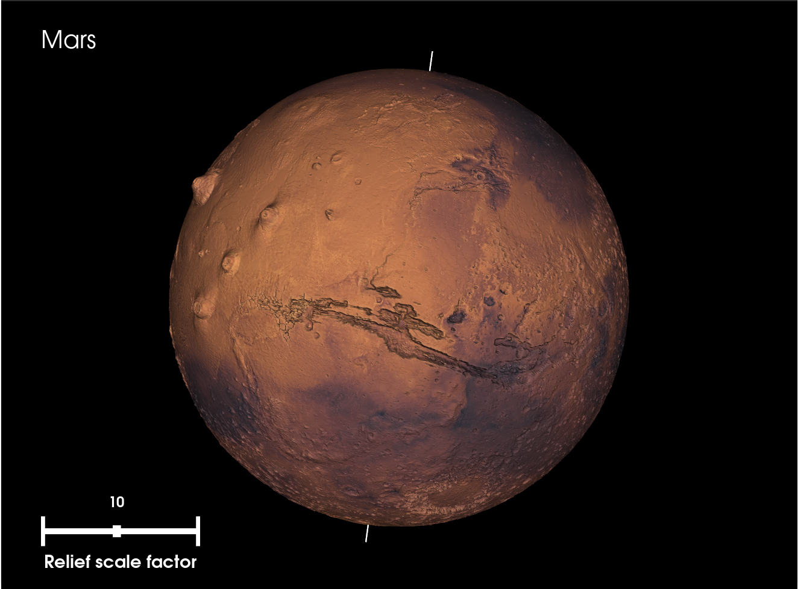
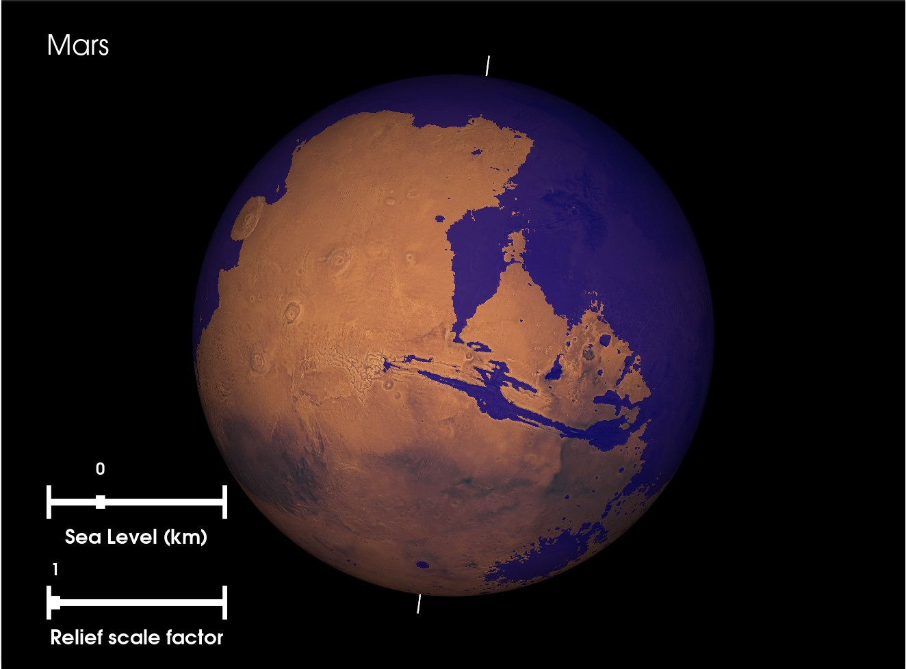
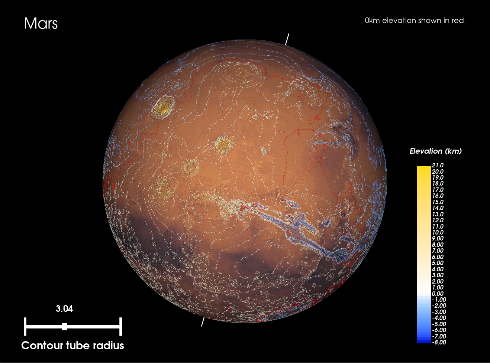

# Visualising celestial objects using VTK


Extension of a university assignment to visualise Mars using a high-res texture
and topography data from the MOLA mission (<https://tharsis.gsfc.nasa.gov/MOLA/mola.php>).

This project extends the assignment project with better data sources,
and includes options for visualising the Moon and Pluto, in addition to Mars.

The project structure is as follows:

```text
planet-vis
│   README.md
│   utils.py                <- Utility functions for other scripts
│   readAssignmentTopo.py   <- Create VTP dataset for the assignment
│   readCylindricalTopo.py  <- Create VTP datasets from cylindrically projected topography maps
│   visTopo.py              <- Create plain 3D visualisation of celestial body
│   visTopoWithSea.py       <- Same as visTopo.py but shows an adjustable sea level
│   visIsolines.py          <- Visualise celestial body topography using contour lines
│
└───data                    <- Contains config. files for visualising different celestial objects
│   │   mars.dat
│   │   moon.dat
│   │   pluto.dat
│   
└───images                  <- Directory to store texture/topography files for visualisations
│   │   links.txt           <- File containing links to data sources
│
└───sources                 <- Pre-made VTP datasets for Mars, the Moon and Pluto
│   │   marstopoV1.vtp
│   │   marstopoV2.vtp
│   │   moontopo.vtp
│   │   plutotopo.vtp
```

## `data/`: config files

Visualisation parameters are defined in config files such as the following (`mars.dat`):

```text
hMin = -8200                 <- Minimum elevation in metres
hMax = 21229                 <- Maximum elevation in metres
R = 3389500                  <- Celestial body radius in metres
tilt = 25                    <- Initial axial tilt of body in degrees
rot = 0                      <- Initial rotation (around polar axis) of body in degrees
sfR = 0.001                  <- Scaling factor for VTK dataset
sf = 6                       <- Inverse scaling factor for original topo data used to create VTK dataset
topo = ...                   <- Filename for topographic map image to use to create VTK dataset
texture = ...                <- Filename for texture image to use for visualisation
vtksource = marstopoV2.vtp   <- Filename for VTK dataset to use (or to create) for visualistion
res = 2000                   <- Phi/Theta resolution for VTK sphere dataset
name = 'Mars'                <- Display name for celestial body
```

These can mostly be left as they are, except for the `texture` parameter, for which you will have to
supply the filename of the image you are using as the texture of the celestial body (see `images/links.txt` for references).

If you would like to create your own versions of the VTK datasets using equirectangularly projected topographic maps, then you need to edit the `topo` parameter, and perhaps tweak the `sf` and `res` parameters according to the data you have.

The same config file is used for both generating a VTK dataset using `readCylindricalTopo.py` as well as for visualising a celestial body using one of `visTopo.py`, `visTopoWithSea.py` or `visIsolines.py`.

## `images/`: topography/texture files

The topographic data used to create the VTK datasets (using `readCylindricalTopo.py`) is in
the form of equirectangularly projected topographic maps, provided as grayscale image files. These,
as well as the equirectangularly projected textures for the visualisations, should be saved to this folder.

`links.txt` includes references to such image files that were used to create the included VTK datasets and the visualisations in the screenshots.

For the visualisations showcased here, the images were pre-processed as follows:

1. Convert to JPG/PNG (if original was TIFF file).
2. Ensure both the texture and elevation maps for a planet correspond (may need to swap left and right halves of an image for example).
3. Fill in any missing data (as in Pluto data) with an average colour from the rest of the image. This is especially important for missing elevation data, so that colours are correctly mapped to heights.

## `sources/`: VTK datasets (data sources)

This folder contains pre-computed VTK datasets for visualising Mars, the Moon and Pluto. These
are VTK sphere sources with elevation data incorporated. They were created using the `readCylindricalTopo.py` script (except for `marstopoV1.vtp` which is the original Uni assignment dataset, created using `readAssignmentTopo.py`).

## Examples

`visTopo.py`



`visTopoWithSea.py`



`visIsolines.py`


